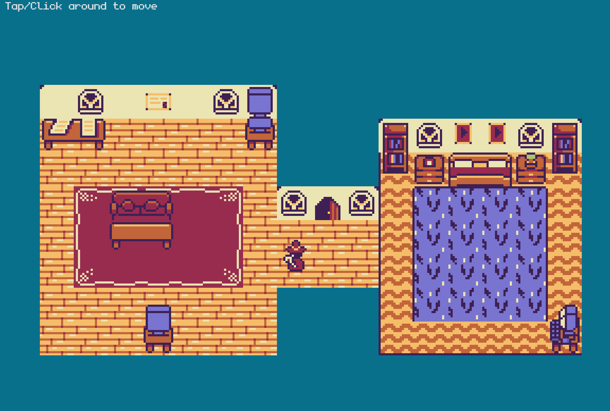

<h1>2D-port-game</h1>
<h2> Portfolio that' a 2D game made with Kaboom.js</h2>

## Overview
This repository contains a 2D game created using Kaboom.js. It's a part of my portfolio where I showcase my coding skills. I initially followed a tutorial from [freeCodeCamp](https://www.youtube.com/watch?v=wy_fSStEgMs&t=1s) to build this game, but I've personalized it and plan to continue refining it as I learn more.
[Link to site](https://karl-young.github.io/2D-port-game/)
  

